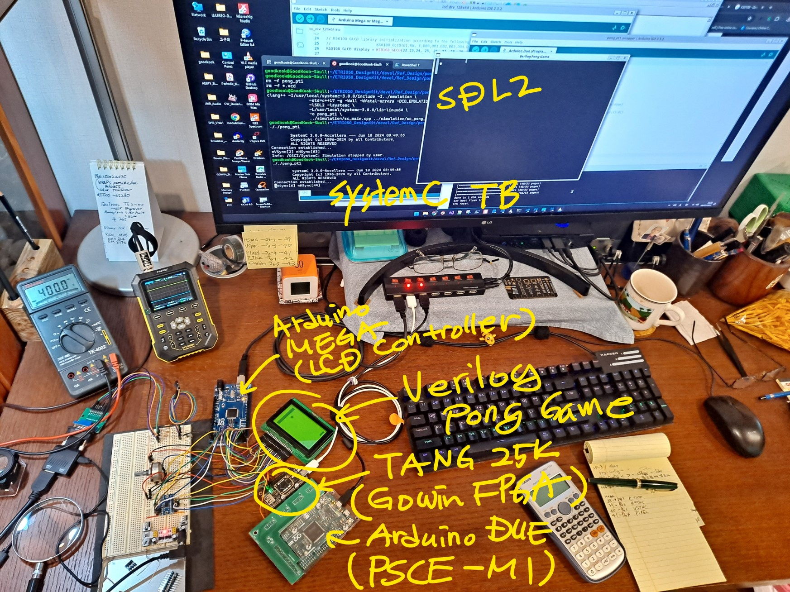
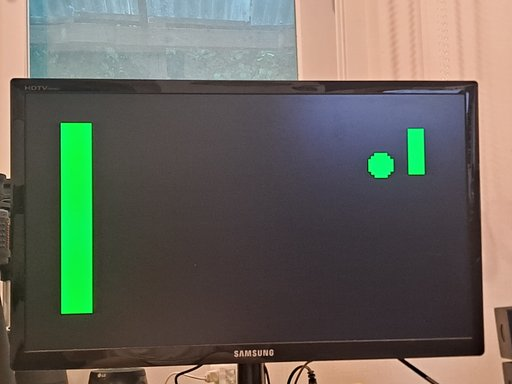
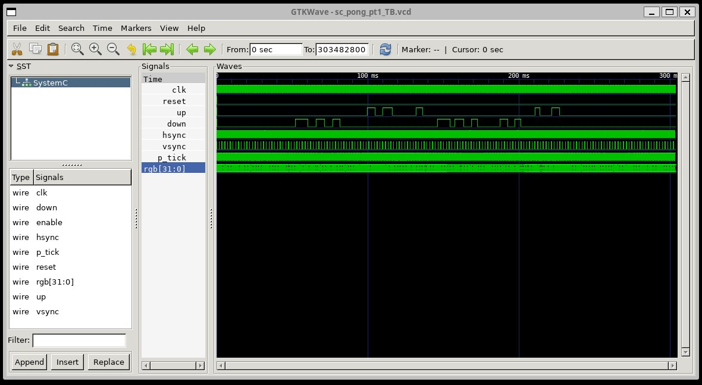
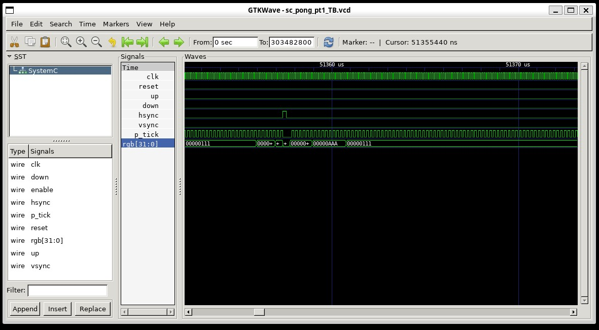
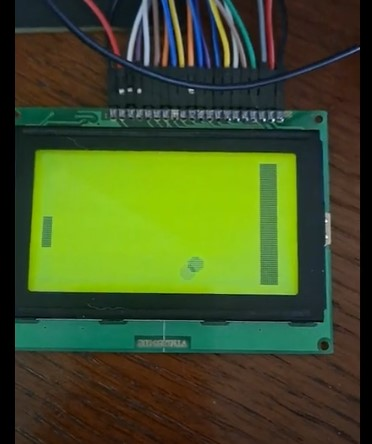

# ETRI-0.5u-CMOS-MPW-DK-Example--pong_pt1

Project: Verilog Pong-Game

Verilog RTL
- Parametized Module (Re-Sizable Pong Table)
- Good combinational circuit description example
- Understanding video signal generation

SystemC Testbench
- Animated Pong Game using SDL2

Arduino MEGA as display controller
- VGAX 120x60 4-Color
- GLCD 128x64 1-Color

Arduino DUE
- PSCE-MI Emulator

FPGA
- TANG 25K Premier(Gowin GW5A-LV25)

Emulation-Mode
- Cycle-Accurate (CA)
- HSync-Transaction (SA)
- No-Transaction (RT)

Simulation
- Verilated RTL with SystemC Testbench

Software tools & config.,

for simulation
- GNU build-essentials (GCC/clang)
- Verilator (Verilog to SC translator)
- SystemC 3.0
- SDL2 (Simple Direct-multimedia Layer)

                                                    +-------------------+
                                                    |    [SystemC TB]   |
                                                    |   +------------+  |
                                                    |   |            |  |
                                                    |   +------+     |  |
                                                +-----------+  |     |  |
                        +-------------+         |           |  |     |  |
                        | Pong        |         | Verilated |  | +---------------+
                        | Verilog RTL |-------->| SystemC   <==> | Animated Pong |
                        | (DUT)       |         | Model     |  | |               |
                        +-------------+         |           |  | |   (SDL2)      |
                                                +-----------+  | +---------------+
                                                    |   +-------+    |  |
                                                    |   |            |  |
                                                    |   +------------+  |
                                                    |   PC/Workstation  |
                                                    +-------------------+

for emulation
- Yosys (Verilog synthesizer)
- Arduino IDE
- Gowin IDE
  
                                                          +--------------------+
                             +-----------------+          |     SystemC TB     |
                             |  [PSCE-wrapper] |          |  +--------------+  |
                             |   +-----------+ |          |  | [SC wrapper] |  |
                +---------+  |   +------+    | |          |  +--+           |  |
      +-------+ |[Peri-IF]|  |+-------+ |    | | +----------+   | (DUT-IF)  |  |
      | GLCD  | |         |  || Pong  | |    | | |[PSCE-API]|   |  +---------------+
      |  or   <=> Arduino <==>  (DUT) <=>    <===>          <===>  | Animated Pong |
      | VGAX  | |  MEGA   |  ||       | |    | | | Arduino  |   |  |               |
      +-------+ |         |  |+-------+ |    | | |   DUE    |   |  |   (SDL2)      |
                +---------+  |   +------+    | | +----------+   |  +---------------+
                             |   +-----------+ |          |   +-+            |  |
                             |  FPGA/TANG 25K  |          |   +--------------+  |
                             +-----------------+          |   PC/Workstation    |
                                                          +---------------------+

 

 

 

 
Or

Click Imagge

